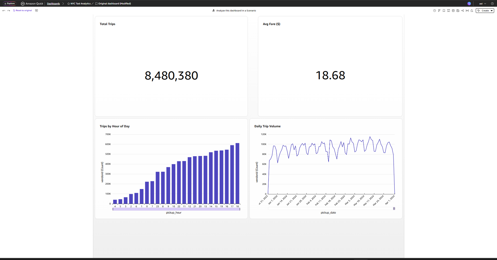
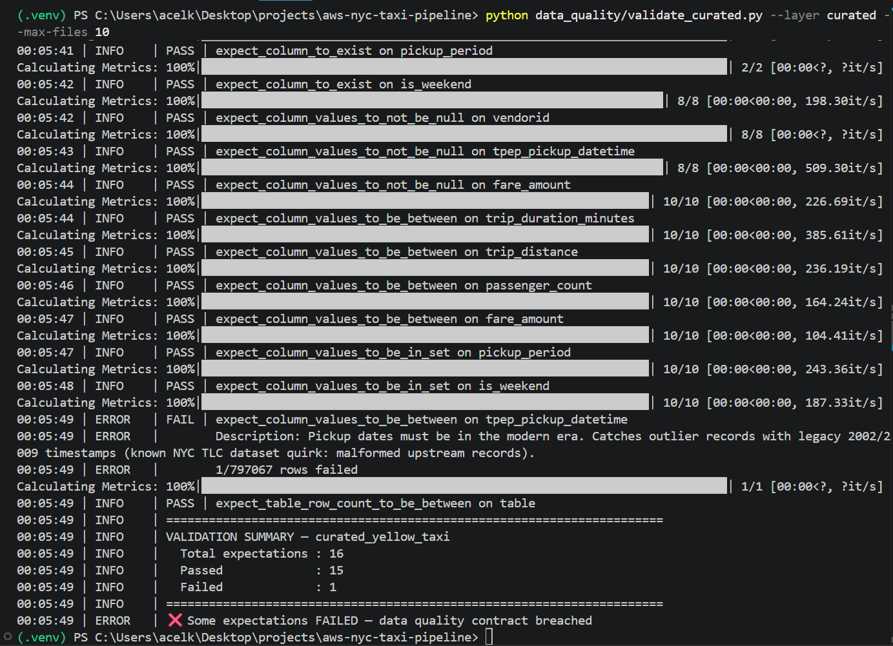

# 🚕 AWS NYC Taxi Data Pipeline

[](https://github.com/Achraf-EL-KHATABI/aws-nyc-taxi-pipeline/actions/workflows/terraform-main.yml) [](https://github.com/Achraf-EL-KHATABI/aws-nyc-taxi-pipeline/actions/workflows/python-lint.yml) [](https://github.com/Achraf-EL-KHATABI/aws-nyc-taxi-pipeline/actions/workflows/python-test.yml)

End-to-end data engineering pipeline on AWS, processing the public NYC Taxi dataset using modern best practices: Infrastructure as Code, partitioned data lake, serverless analytics, orchestration, CI/CD, and automated data quality.

> **Status:** ✅ Production-ready — 9 phases complete from ingestion to BI. See [Roadmap](#️-roadmap).

---

## 🏗️ Architecture

```
┌──────────────┐     ┌─────────────┐     ┌──────────────┐     ┌─────────────┐
│  NYC Taxi    │────▶│  S3 (raw)   │────▶│  AWS Glue    │────▶│ S3 (curated)│
│  Public Data │     │  Parquet    │     │  PySpark Job │     │   Parquet   │
└──────────────┘     └─────────────┘     └──────────────┘     └─────────────┘
                                                                      │
                                                                      ▼
                                                              ┌─────────────┐
                                                              │   Athena    │
                                                              │  + Glue     │
                                                              │  Catalog    │
                                                              └─────────────┘
                                                                      │
                                                                      ▼
                                                              ┌─────────────┐
                                                              │  QuickSight │
                                                              │  Dashboard  │
                                                              └─────────────┘

Orchestration:  AWS Step Functions  +  EventBridge Scheduler  +  SNS
Deployment:     Terraform IaC  +  GitHub Actions  +  OIDC
Quality:        pytest  +  Great Expectations
```

## 🛠️ Tech Stack

| Layer | Technology |
| --- | --- |
| **Infrastructure as Code** | Terraform (remote backend: S3 + DynamoDB lock) |
| **Storage** | Amazon S3 (versioned, encrypted, Hive-partitioned) |
| **Ingestion** | Python (boto3, argparse, env-driven config) |
| **Processing** | AWS Glue (PySpark, Glue 4.0, G.1X workers) |
| **Catalog** | AWS Glue Data Catalog + Crawlers |
| **Query Engine** | Amazon Athena (serverless, workgroup cost guardrails) |
| **Orchestration** | AWS Step Functions + EventBridge Scheduler |
| **Notifications** | Amazon SNS (email) |
| **Visualization** | Amazon QuickSight (Direct Query) |
| **CI/CD** | GitHub Actions + OIDC (no stored secrets) |
| **Testing** | pytest + pytest-cov + pytest-mock |
| **Data Quality** | Great Expectations v1.x |
| **Region** | eu-west-3 (Paris) |

## 📂 Project Structure

```
aws-nyc-taxi-pipeline/
├── terraform/              # Main infrastructure (S3, Glue, Athena, Step Functions, QuickSight)
│   ├── main.tf             # S3 buckets (raw, curated, athena-results, glue-assets)
│   ├── glue.tf             # Glue Catalog database + crawlers
│   ├── glue_job.tf         # PySpark ETL job + IAM role
│   ├── athena.tf           # Athena workgroups with cost guardrails
│   ├── step_functions.tf   # State machine + SNS + EventBridge Scheduler
│   ├── quicksight.tf       # Athena data source + dedicated workgroup
│   ├── github_oidc.tf      # OIDC provider for GitHub Actions
│   └── versions.tf         # Remote backend (S3 + DynamoDB lock)
├── terraform-bootstrap/    # State backend bootstrap (deployed once)
├── scripts/                # Python ingestion utilities
│   └── upload_to_s3.py     # NYC TLC → S3 with Hive partitioning
├── glue_jobs/              # PySpark ETL jobs
│   └── transform_taxi_data.py  # Quality filters + derived columns
├── state_machine/          # Step Functions definition
│   └── taxi_pipeline.asl.json
├── data_quality/           # Great Expectations validation suite
│   ├── expectations.py     # 16 contracts on curated layer
│   └── validate_curated.py # Standalone validator (CLI)
├── tests/                  # pytest unit tests (16 tests, ~80% coverage)
├── sql/                    # Sample Athena queries
├── docs/                   # Setup guides + screenshots
│   ├── quicksight-setup.md
│   └── screenshots/
├── .github/workflows/      # CI/CD pipelines (OIDC, no stored secrets)
│   ├── terraform-pr.yml    # Plan + comment on PR
│   ├── terraform-main.yml  # Plan → approval → apply
│   ├── python-lint.yml     # ruff check + format
│   └── python-test.yml     # pytest + coverage
├── pyproject.toml          # pytest + ruff config
├── requirements.txt
└── README.md
```

## 🚀 Getting Started

### Prerequisites

- AWS account with programmatic access
- Terraform ≥ 1.5
- Python ≥ 3.10
- AWS CLI configured (`aws configure`)

### Deploy the infrastructure

```bash
cd terraform
cp terraform.tfvars.example terraform.tfvars  # then edit values
terraform init
terraform plan
terraform apply
```

### Tear down (avoid AWS charges)

```bash
terraform destroy
```

## 🔐 Security & Best Practices

- ✅ S3 buckets with versioning enabled
- ✅ Server-side encryption (AES-256)
- ✅ Public access fully blocked
- ✅ Resources tagged (Project, Environment, Owner, ManagedBy)
- ✅ No credentials in code (`.tfvars` gitignored, OIDC for CI)
- ✅ Least-privilege IAM policies on all 5 service roles
- ✅ Remote state with DynamoDB lock (collaborative-safe)

## 💻 Usage

### Setup

```bash
# Activate virtualenv (Windows PowerShell)
.\.venv\Scripts\Activate.ps1
# (Linux/Mac)
source .venv/bin/activate

# Install dependencies
pip install -r requirements.txt

# Configure environment
cp .env.example .env  # then edit .env with your bucket names
```

### Ingest NYC Taxi data

```bash
# Single month
python scripts/upload_to_s3.py --year 2024 --months 1

# Multiple months
python scripts/upload_to_s3.py --year 2024 --months 1 2 3

# Different taxi type
python scripts/upload_to_s3.py --taxi-type green --year 2024 --months 1
```

Data lands in S3 with **Hive-style partitioning** for native Glue/Athena partition discovery:

```
s3://<raw-bucket>/
└── taxi_type=yellow/
    └── year=2024/
        └── month=01/
            └── yellow_tripdata_2024-01.parquet
```

### Catalog data with Glue Crawler

```bash
aws glue start-crawler --name nyc-taxi-pipeline-raw-crawler --region eu-west-3
```

Wait until state is `READY`:

```bash
aws glue get-crawler --name nyc-taxi-pipeline-raw-crawler --region eu-west-3 --query "Crawler.State"
```

### Query data with Athena

Sample SQL queries are available in [`sql/`](sql/). Run them via the Athena console (workgroup: `nyc-taxi-pipeline-workgroup`) or with the AWS CLI.

**Example — multi-month aggregation:**

```sql
SELECT year, month, COUNT(*) AS trips, ROUND(SUM(total_amount), 2) AS revenue_usd
FROM nyc_taxi_pipeline_raw_ake_2026_05
WHERE taxi_type = 'yellow'
GROUP BY year, month
ORDER BY year, month;
```

Sample output (Jan–Mar 2024 yellow taxi data):

| year | month | trips     | revenue_usd  |
| ---- | ----- | --------- | ------------ |
| 2024 | 01    | 2,964,624 | 79,456,384   |
| 2024 | 02    | 3,007,526 | 80,073,615   |
| 2024 | 03    | 3,582,628 | 97,162,914   |

### Run the ETL job (raw → curated)

```bash
# Start the PySpark Glue job
aws glue start-job-run \
  --job-name nyc-taxi-pipeline-transform-taxi \
  --region eu-west-3

# Monitor (replace <RUN_ID>)
aws glue get-job-run \
  --job-name nyc-taxi-pipeline-transform-taxi \
  --run-id <RUN_ID> \
  --region eu-west-3 \
  --query "JobRun.JobRunState"

# Once SUCCEEDED, catalog the curated layer
aws glue start-crawler --name nyc-taxi-pipeline-curated-crawler --region eu-west-3
```

The ETL job:

- **Filters** rows with negative durations, zero distances, invalid passenger counts
- **Derives** analytics-ready columns: `trip_duration_minutes`, `pickup_period`, `is_weekend`, `fare_per_mile`, `tip_percentage`, date parts
- **Writes** Snappy-compressed Parquet partitioned by `pickup_year/pickup_month/pickup_day`
- **Bookmarks** are enabled — re-running the job won't re-process the same files

## 🗄️ State Management

Terraform state is stored remotely in S3 with DynamoDB locking, enabling safe collaborative & CI/CD workflows. The backend infrastructure lives in a separate root module (`terraform-bootstrap/`) that's deployed once and rarely touched.

```
terraform-bootstrap/   ← runs once: creates state bucket + lock table
terraform/             ← main infrastructure, uses the bootstrap backend
```

- **State bucket**: versioning + encryption + `prevent_destroy` lifecycle
- **Lock table**: DynamoDB PAY_PER_REQUEST with point-in-time recovery
- **Pattern**: bootstrap stack avoids the chicken-and-egg of "the backend storing its own creation"

## 🎼 Orchestration

The full pipeline is orchestrated by an **AWS Step Functions** state machine that chains all the data engineering steps with retries, error handling, and notifications:

```
Start Raw Crawler → Wait for READY → Run Glue ETL Job → Start Curated Crawler → Wait for READY → Notify (SNS)
```

Key features:

- **Polling loops** with `Wait` + `Choice` states for crawler completion
- **Native sync integration** for Glue job (`startJobRun.sync` — no manual polling needed)
- **Retry policies** with exponential backoff on transient errors
- **Catch handlers** routing all failures to a single notification state
- **CloudWatch logging** of execution history
- **EventBridge Scheduler** for daily automated runs (currently disabled — enable in `step_functions.tf`)
- **SNS topic** for success/failure notifications

### Trigger manually

```bash
aws stepfunctions start-execution \
  --state-machine-arn $(aws stepfunctions list-state-machines \
    --query "stateMachines[?name=='nyc-taxi-pipeline-pipeline'].stateMachineArn" \
    --output text) \
  --region eu-west-3 \
  --input '{}'
```

### State machine definition

The full Amazon States Language definition is in [`state_machine/taxi_pipeline.asl.json`](state_machine/taxi_pipeline.asl.json), templated by Terraform with the actual resource names.

## 📊 BI Dashboard (QuickSight)

The curated layer feeds an interactive Amazon QuickSight dashboard for business analytics — the visible end of the pipeline.



### Built on the curated layer

The dashboard queries the `yellow_taxi` Glue catalog table directly via Athena, with no data movement — every visual reflects the latest output of the ETL pipeline.

**Key metrics (Jan–Mar 2024, post-quality-filter):**

- **8.48 M** total trips
- **$18.68** average fare
- Hourly demand curve, daily seasonality, weekend vs weekday patterns

### Visualizations

| Visual | Type | Insight |
| --- | --- | --- |
| Total Trips | KPI | Headline volume |
| Average Fare | KPI | Economic signal |
| Trips by Hour of Day | Bar chart | Peak demand profile |
| Daily Trip Volume | Line chart | Weekly seasonality, outliers |
| Pickup Period | Donut | Morning/afternoon/evening/night split |
| Weekend vs Weekday | Bar chart | Fare behavior comparison |

### Architecture choice — Direct Query (no SPICE)

The dataset uses **Direct Query** mode rather than QuickSight's SPICE in-memory cache. Trade-off:

- ✅ Always fresh — reflects every pipeline run immediately
- ✅ No duplicated storage cost
- ❌ Slightly higher per-visual latency (~3–5 s vs <1 s)

For larger workloads or executive dashboards with many concurrent readers, SPICE would be the right call.

### IaC vs UI boundaries

QuickSight is intentionally UI-driven for visualization design — Terraform (`quicksight.tf`) provisions:

- A dedicated Athena workgroup `nyc-taxi-pipeline-quicksight` (cost & monitoring isolation)
- The Athena data source connection with author-level permissions
- A scoped IAM permission set

The dataset, analysis, and dashboard are created via the QuickSight console — this is the documented AWS pattern as of 2026. Setup is reproducible in ~10 minutes following the steps in [docs/quicksight-setup.md](docs/quicksight-setup.md).

## 🧪 Testing & Data Quality

The pipeline has **two complementary layers** of automated validation:

### Layer 1: Code Tests (pytest)

Unit tests on the Python scripts using `pytest`, `pytest-mock`, and `pytest-cov`. Currently **16 tests** covering CLI argument parsing, S3 path construction with Hive partitioning, download/upload error handling, and end-to-end ingestion logic. Coverage on `upload_to_s3.py` is approximately 80%.

Tests run automatically on every PR via the [Python Tests workflow](.github/workflows/python-test.yml).

```bash
pytest tests/ -v
```

### Layer 2: Data Quality (Great Expectations)

Code tests verify the **code**. Data quality validations verify the **data flowing through it**.

The `data_quality/` module defines 16 explicit contracts on the curated layer, covering schema, completeness, business rules, categorical consistency, temporal sanity, and volume bounds. See [`data_quality/README.md`](data_quality/README.md) for the full list.

```bash
python data_quality/validate_curated.py --layer curated --max-files 10
```

**Real-world catch**: this suite detected that ~0.0001% of NYC TLC records have malformed timestamps (years like 2002 or 2009 mixed into 2024 batches). Without this validation, those records would silently corrupt BI dashboards.



### Philosophy

Tests catch coding mistakes. Data quality validations catch reality mistakes — upstream data drifts, malformed records, business rule violations. A mature data pipeline needs both.

## 🤖 CI/CD

GitHub Actions automate Terraform validation and deployment using **OIDC** (no long-lived AWS credentials stored in GitHub).

| Workflow | Trigger | Action |
| --- | --- | --- |
| `terraform-pr.yml` | Pull request to `main` | `fmt`, `validate`, `plan`, comment diff on PR |
| `terraform-main.yml` | Push to `main` | `plan` → manual approval → `apply` |
| `python-lint.yml` | PR with `.py` changes | Run `ruff check` and `ruff format --check` |
| `python-test.yml` | PR / push with code changes | Run `pytest` + coverage |

### Setup

The IAM role for GitHub Actions is created by Terraform (`github_oidc.tf`). After the first manual apply, set these GitHub repo variables:

- `AWS_ROLE_ARN` — output `github_actions_role_arn` from Terraform
- `AWS_REGION` — `eu-west-3`
- `TF_BUCKET_SUFFIX` — your unique S3 bucket suffix
- `NOTIFICATION_EMAIL` — for SNS subscription
- `QUICKSIGHT_USERNAME` — for QuickSight data source permissions

No secrets, no access keys. Authentication uses GitHub's OIDC tokens, which AWS validates and exchanges for short-lived credentials per workflow run.

## 🗺️ Roadmap

- [x] **Phase 1** — Bootstrap S3 buckets (raw + curated) with Terraform
- [x] **Phase 2** — Ingest NYC Taxi data via Python + boto3
- [x] **Phase 3** — Glue Crawler + Data Catalog
- [x] **Phase 4** — Glue ETL job: raw → partitioned & enriched Parquet
- [x] **Phase 5** — Athena queries + sample analytics
- [x] **Phase 6** — QuickSight Dashboard
- [x] **Phase 7** — Orchestration with Step Functions
- [x] **Phase 8** — CI/CD with GitHub Actions
- [x] **Phase 9** — Tests & Data Quality
- [ ] **Phase 10** — Monitoring with CloudWatch dashboards
- [ ] **Phase 11** — Apache Iceberg migration on curated layer

## 📊 Dataset

[NYC Taxi & Limousine Commission Trip Records](https://www.nyc.gov/site/tlc/about/tlc-trip-record-data.page) — public dataset of yellow & green taxi trips in New York City. ~30 GB/year, ideal for testing data engineering patterns at scale.

## 📈 Project Stats

| Metric | Value |
| --- | --- |
| **Build time** | ~8 sessions (~20 hours total) |
| **Total AWS cost** | < 5€ (mostly Glue ETL + Athena queries) |
| **Data processed** | 9.5M raw trips (Jan–Mar 2024), 8.48M post-quality-filter |
| **Pipeline runtime** | ~6–8 min end-to-end (Step Functions) |
| **Code tests** | 16 pytest tests, ~80% coverage |
| **Data quality contracts** | 16 expectations, 1 real upstream issue detected |
| **Outlier detection rate** | 0.0001% (1 record / 797 067 sampled) |
| **Infrastructure** | 100% Terraform-managed, 5 IAM roles least-privilege |
| **Deployment** | Review-then-approve via GitHub Actions + OIDC |

---

## 👤 Author

**Achraf El Khatabi** — Cloud / Data Engineer · AWS Certified · 14+ years in BSS Telecom systems.
Open to remote opportunities (CET).

[LinkedIn](https://www.linkedin.com/in/achraf-el-khatabi) · [Email](mailto:ac.elkhatabi@gmail.com)

## 📄 License

MIT — see [LICENSE](LICENSE).
